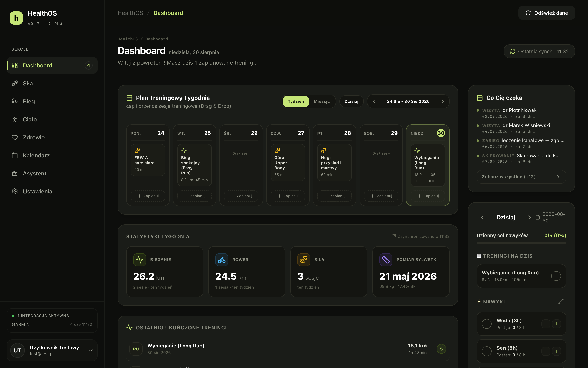
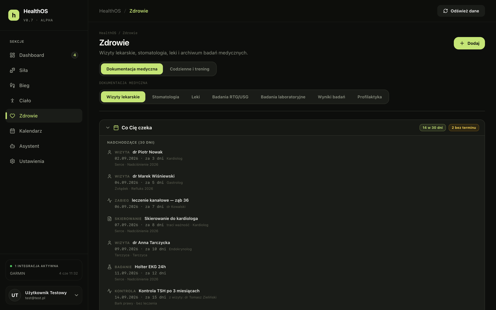
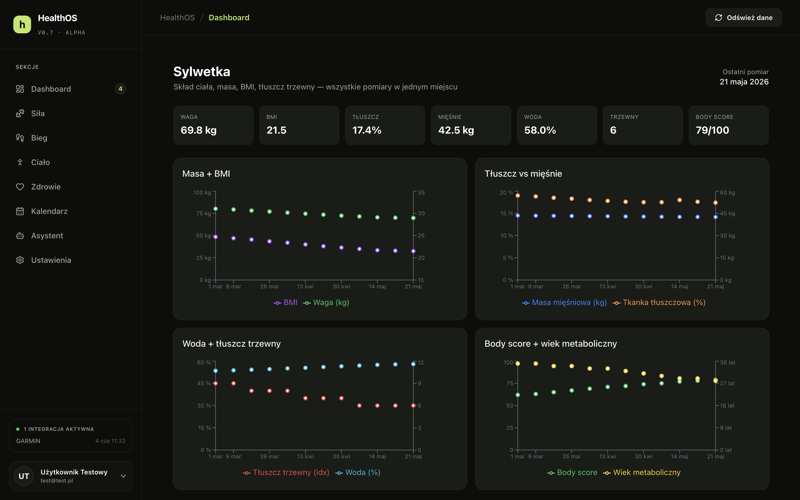
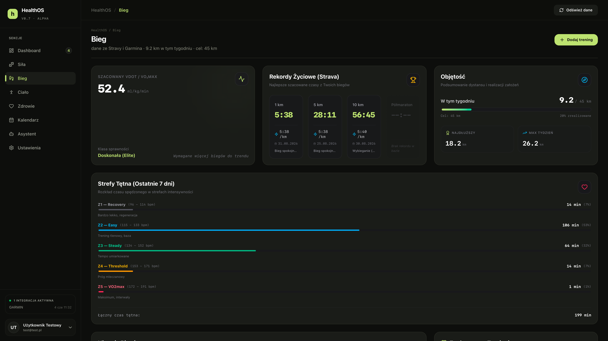
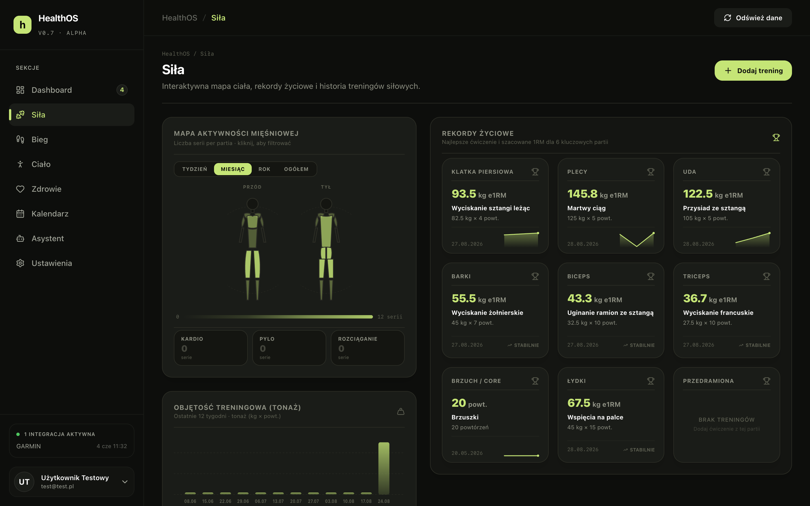
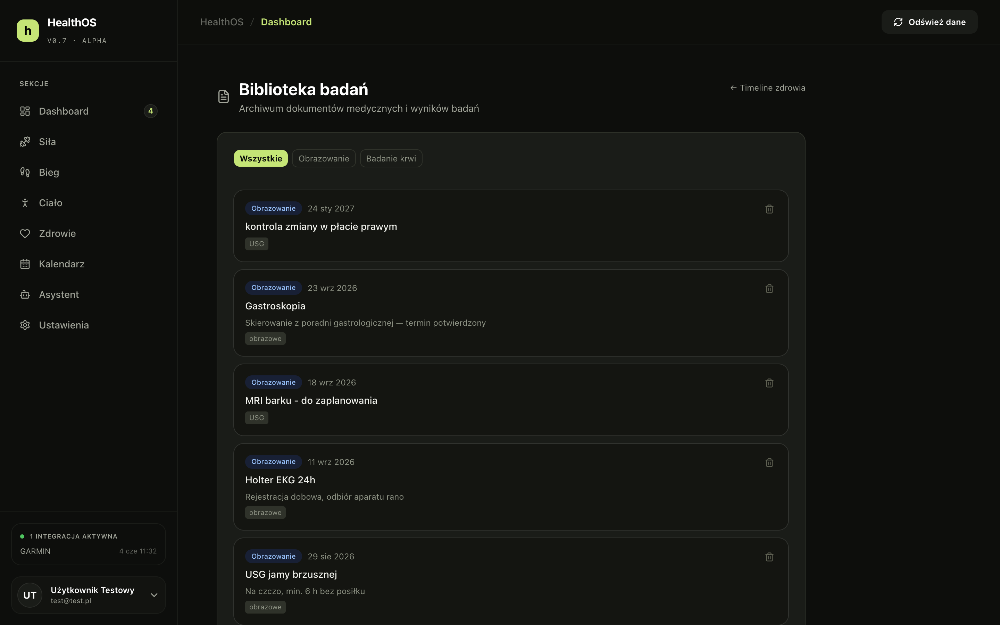
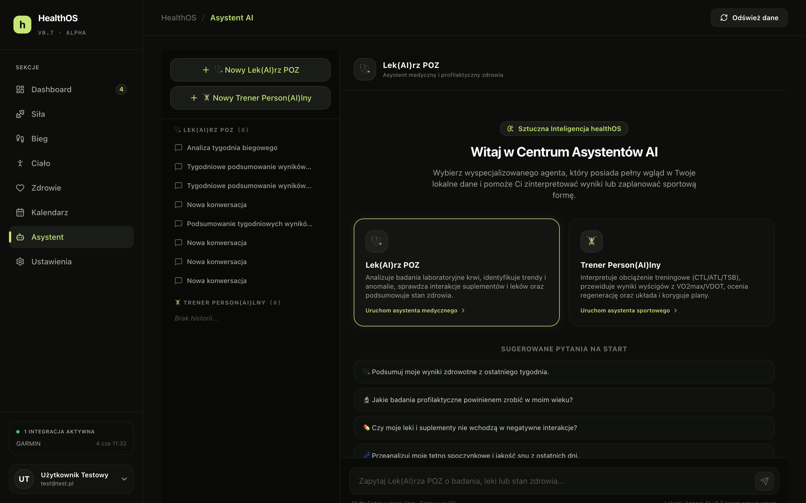

# healthOS

Poznaj healthOS - osobiste centrum zdrowia i aktywności na Twoim Macu. Jest
Twoim dziennikiem i historią wizyt lekarskich i stomatologicznych. Pozwala Ci
zbierać dane z urządzeń (w tym z zegarka czy pierścienia) i aplikacji (takich
jak Strava, Runna czy Hevy). Cała baza danych (a są tu dane medyczne) pozostaje
na Twoim komputerze.

**Baza danych to zwykły plik SQLite na Twoim dysku** - nie ma serwera, nie ma
chmury, nie ma konta w cudzej usłudze. Aplikacja pozwala na połączenie z AI
poprzez klucz API, dzięki czemu możesz analizować swoje dane z pomocą wybranych
przez siebie modeli, np. Gemini.

> **⚠️ Uwaga! To nie jest wyrób medyczny.** healthOS nie służy do diagnozowania,
> leczenia ani monitorowania stanu zdrowia i nie zastępuje konsultacji z lekarzem.
> Wskaźniki, podsumowania i odpowiedzi asystenta AI mogą być błędne. Nie podejmuj
> na ich podstawie decyzji medycznych. Za dane, które wprowadzisz do aplikacji,
> odpowiadasz wyłącznie Ty.

---

## Jak to wygląda

Zrzuty pochodzą z konta testowego - wszystkie widoczne na nich dane są zmyślone.

**Pulpit** - plan treningowy tygodnia, statystyki, agenda zdrowotna i nawyki w jednym miejscu.



**Zdrowie** - wizyty, zabiegi, skierowania i kontrole z terminami.



**Sylwetka** - masa, BMI, tłuszcz i mięśnie w czasie.



**Bieg** - szacowany VO₂max, rekordy życiowe, objętość i strefy tętna.



**Siła** - mapa aktywności mięśniowej, rekordy na partie i tonaż treningowy.



**Biblioteka badań** - archiwum dokumentów medycznych i wyników.



**Asystent AI** - dwie role, „lekarz" i „trener", z dostępem do Twoich danych.



---

## Co potrafi

**Zdrowie**
- Dokumentacja medyczna - wgrywanie PDF-ów z wynikami, automatyczne wyciąganie
  biomarkerów i śledzenie ich w czasie
- Wizyty lekarskie ze słownikami lekarzy, placówek i części ciała
- Epizody leczenia - powiązane wizyty, skierowania i dokumenty w jednej osi czasu
- Skierowania z terminami ważności i przypomnieniami
- Karta stomatologiczna
- Leki i suplementy wraz ze składem oraz dziennikiem przyjmowania

**Aktywność**
- Aktywności z importu (bieganie, rower, pływanie i inne)
- Treningi siłowe z podziałem na ćwiczenia, serie i partie mięśniowe
- Plany biegowe i porównanie planu z wykonaniem
- Sen, tętno, pomiary ciała i wpisy samopoczucia
- Nawyki z dziennikiem

**Analiza**
- Pulpit z podsumowaniem dnia i agendą zdrowotną
- Wykresy trendów dla biomarkerów i metryk
- Wskaźnik kondycji liczony z dostępnych danych
- Asystent AI w dwóch rolach - „lekarz" i „trener" - z dostępem do Twoich danych

## Integracje

Wszystkie są opcjonalne. Bez kluczy po prostu się nie włączają.

| Źródło | Co pobiera | Jak |
|---|---|---|
| Strava | aktywności | OAuth |
| Hevy | treningi siłowe | klucz API w ustawieniach |
| Garmin | sen, tętno, kroki | skrypt Pythona |
| Colmi R02 | sen, tętno, SpO₂ | skrypt BLE |
| Runna | plany biegowe | import |
| Google Calendar | synchronizacja wizyt | OAuth |

## Stos

Next.js (App Router) · React · TypeScript · Prisma + SQLite (better-sqlite3) ·
Auth.js · Tailwind CSS · shadcn/ui + Base UI · Recharts · Vercel AI SDK + Google Gemini ·
Electron + electron-builder

---

## Uruchomienie

### Wymagania

- Node.js 20 lub nowszy
- macOS, Linux lub Windows (wersja desktopowa: tylko macOS)

### Instalacja

```bash
git clone https://github.com/fisieek/healthOS-open-source.git
cd healthOS-open-source
npm ci
```

### Konfiguracja

```bash
cp .env.example .env.local
```

Otwórz `.env.local` i uzupełnij przynajmniej `AUTH_SECRET`:

```bash
openssl rand -base64 32
```

Reszta zmiennych dotyczy integracji i jest opcjonalna - aplikacja uruchomi się bez nich.

### Baza danych

```bash
npx prisma generate
node scripts/run-migrations.js "$PWD/prisma/dev.db" "$PWD/prisma/migrations"
```

Skrypt migracyjny przyjmuje dwa argumenty: ścieżkę do pliku bazy i katalog
z migracjami. Oba muszą być bezwzględne.

> Projekt używa własnego skryptu zamiast `prisma migrate`, bo ten sam kod aplikuje
> migracje przy starcie aplikacji desktopowej. Nie uruchamiaj `prisma migrate reset`
> - skasuje bazę.

### Start

```bash
npm run dev
```

Aplikacja czeka na [http://localhost:3000](http://localhost:3000). Załóż konto
przez `/register` - pierwszy użytkownik nie jest w żaden sposób wyróżniony,
aplikacja jest jednoosobowa z założenia, ale nie zakłada, kim jesteś.

### Aplikacja startuje pusta

Co jest gotowe od pierwszego uruchomienia:

- **słownik biomarkerów** - nazwy, jednostki i zakresy norm, wraz z aliasami
  używanymi przez różne laboratoria, żeby rozpoznawanie wyników działało od razu
- **słownik nutrientów** - zakładany automatycznie przez migracje
- **słowniki medyczne i stomatologiczne** - części ciała, rodzaje zabiegów

Żeby zobaczyć aplikację wypełnioną treścią, dodaj kilka wpisów ręcznie -
wizytę, badanie, lek. Zajmie to minutę, a wszystko, co wpiszesz, zostaje u Ciebie.

---

## Wersja desktopowa (macOS)

```bash
npm run desktop:build
```

Wynik trafia do `dist-desktop/` jako `.dmg`. Aplikacja pakuje serwer Next.js
w trybie standalone i uruchamia go jako proces potomny Electrona.

Build **nie jest podpisany** certyfikatem Apple Developer, więc przy pierwszym
uruchomieniu macOS poprosi o otwarcie przez **prawy klik → Otwórz**. Powody tej
decyzji i pełną listę pułapek buildu desktopowego opisuje
[DEVELOPMENT.md](DEVELOPMENT.md).

---

## Gdzie leżą Twoje dane

| Tryb | Baza | Pliki |
|---|---|---|
| Web (`npm run dev`) | `prisma/dev.db` | `storage/` |
| Desktop | `~/Library/Application Support/healthOS/healthos.db` | `~/Library/Application Support/healthOS/uploads/` |

Nic nie jest wysyłane na zewnątrz **poza** tym, co wynika z włączonych integracji:
zapytania do API Strava, Hevy czy Google Calendar oraz treść rozmów z asystentem
AI, która trafia do Google Gemini. Nie włączając tych integracji, zostawiasz
wszystko u siebie.

Kopie zapasowe robisz sam - nikt nie zrobi ich za Ciebie. Baza to jeden plik,
a w projekcie są do tego dwa polecenia. Działają też przy uruchomionej
aplikacji, bo korzystają z `sqlite3 .backup`, a nie ze zwykłego kopiowania:

```bash
npm run db:backup                    # baza z DATABASE_URL → backups/
npm run db:backup -- desktop preWyjazd   # baza desktopowa, z etykietą w nazwie
```

Przywracanie pyta o potwierdzenie i **zawsze** odkłada obecny stan do
`backups/`, zanim cokolwiek nadpisze:

```bash
npm run db:restore                   # najnowsza kopia → baza z DATABASE_URL
npm run db:restore -- backups/dev-preWyjazd-20260830-214500.db
```

---

## Status projektu

healthOS powstał jako narzędzie do własnego użytku i tak też jest rozwijany.
Publikuję go jako inspirację lub produkt do własnego rozwoju. Powstał w całości
przy użyciu AI - nie nadaje się do skalowania i komercjalizacji.

Czego się spodziewać:
- Interfejs, trasy i słowniki medyczne są **po polsku**
- Słowniki biomarkerów i nazewnictwo badań są dopasowane do polskich laboratoriów
- Wersja desktopowa jest testowana wyłącznie na macOS
- Nie ma testów automatycznych ani gwarancji stabilności API

## Licencja

[MIT](LICENSE) © 2026 Filip Stolarski
